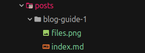

_Phần 8_

## Slug Field?
Slug field là một cách để tạo ra url cho một bài blog bất kỳ. Ví dụ: bài blog demo chúng ta làm trong bài trước có thể sẽ được đặt tại `http://tên-miền-blog.com/demo`. 

Cách chúng ta sinh slug field rất đơn giản. Với tất cả các file Markdown nằm trong thư mục `posts`, chúng ta sẽ thu gọn đường dẫn của nó tính từ gốc là `posts`. Ví dụ với file như sau:
 
 
 
slug field của bài blog này sẽ là `/blog-guide-1/`. Rất đơn giản

Để tạo slug field, ta viết đoạn code sau vào file `gatsby-node.js`

```js
const { createFilePath } = require(`gatsby-source-filesystem`)

exports.onCreateNode = ({ node, getNode, actions }) => {
    const { createNodeField } = actions
    if (node.internal.type === `MarkdownRemark`) {
        const slug = createFilePath({ node, getNode, basePath: `posts` })
        createNodeField({
            node,
            name: `slug`,
            value: slug,
        })
    }
}

```

## Template.

Các bài blog đều có chung một bố cục, chỉ khác nhau về nội dung. Vì vậy chúng ta có thể tạo cho nó một mẫu (template) và tự động điền các thông tin của bài blog vào các vị trí thích hợp trong mỗi trang.
Tạo một thư mục ở trong `src` có tên là `templates`. Tạo trong đó một file `blog-post.js` với nội dung như sau:

```jsx harmony
import React from "react"
import Helmet from "react-helmet"
import { graphql, useStaticQuery } from "gatsby"

export default function Template() {
    const { markdownRemark: post } = useStaticQuery(graphql`
        query($path: String!) {
            markdownRemark(frontmatter: { path: { eq: $path } }) {
                html
                frontmatter {
                    date
                    title
                }
            }
        }
    `)
    return (
        <div>
            <Helmet title={`Blog - ${post.frontmatter.title}`} />
            <div>
                <h1>{post.frontmatter.title}</h1>
                <div dangerouslySetInnerHTML={{ __html: post.html }} />
            </div>
        </div>
    )
}
```

## Page?
