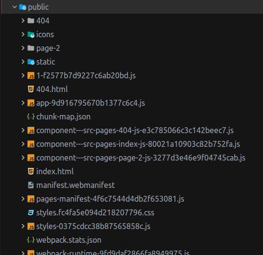

## Bắt đầu develop với Gatsby
CLI của Gatsby có một số câu lệnh để làm dự án. Khi chạy `gatsby new blog` một số câu lệnh sẽ được đặt trong file `package.json`. Chúng ta hãy check content của nó. Để ý kĩ mục `scripts`

Để chạy các câu lệnh ở đây, bạn cần chạy `yarn run tên_câu_lệnh`. Chúng ta sẽ thử chạy câu lệnh `yarn run develop` xem sao.

Bây giờ, nếu bạn mở `locahost:8000` ở trong trình duyệt, bạn sẽ nhìn thấy phiên bản phát triển của trang web. Gatsby cũng sử dụng hot reload giống create-react-app, tức là khi bạn chỉnh sửa code, bản phát triển này sẽ tự chạy lại phiên bản mới.

Sau khi phát triển xong, mình có thể chạy câu lệnh `yarn run build` để tạo ra phiên bản hoàn thiện. 

Lúc này, Gatsby sẽ bundle code nằm trong `src` của bạn thành một mớ các file HTML, CSS, JS và đưa nó vào trong thư mục `public`, trông nó như thế này

Bạn sẽ không cần quan tâm cái đống này viết gì, bạn chỉ cần đưa nó lên hosting của bạn là được.

Okay, cuối cùng có một câu lệnh nữa là `serve`. Sau khi bạn build xong, câu lệnh này sẽ đưa thư mục `public` đến `localhost:9000`. Bạn sẽ xem được sản phẩm của mình trông chính xác như thế nào khi đưa lên hosting.

Nếu bạn đã khá thoải mái với workspace của mình, hãy chuyển sang phần tiếp theo.  