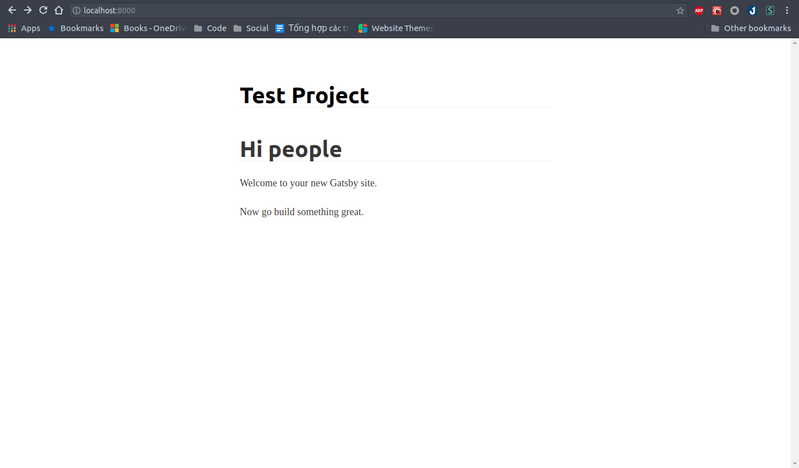

## CSS Module.
Nếu bạn nào đã từng làm thử web thuần chỉ HTML, CSS, JS, các bạn sẽ biết rằng, nếu file HTML include nhiều file CSS cùng lúc, thì style của nó sẽ ghi đè lên nhau. Đây gọi là Global CSS.

CSS Module, ngược lại, sẽ chỉ apply style của nó trong một scope xác định. Ví dụ:
```jsx
// JS
import style from "./style.module.css"
...
<div className={style.div}/>
```

```css
/*style.module.css*/
.div {
    /* Viết style ở đây */
}

```

Trên thực tế, CSS Module không được hỗ trợ bởi trình duyệt. Cách nó hoạt động là: Khi Webpack bundle code để deploy, nó sẽ đọc từng file CSS Module, sinh cho nó và các class ở trong này một mã hash riêng để tránh conflict. CSS Module chỉ nằm trong code development, không tồn tại trong code production.

## Sử dụng CSS Module.
Gatsby hỗ trợ CSS Module out-of-the-box, bạn không cần config thêm gì cả, chỉ việc viết.

Okay hãy thử làm một file CSS Module cho file `component\header.js`

Đầu tiên tạo file `header.module.css`. Hãy nhớ rằng để CSS Module trong Gatsby hoạt động được, phải viết tên file có đuôi `.module.css`. Viết đoạn code dưới đây vào file:
```css
.header {
    background: none;
    margin-bottom: 1.45rem;
}

.div {
    margin: 0 auto;
    max-width: 960px;
    padding: 1.45rem 1.0875rem;
}

.h1 {
    margin: 0
}

.Link {
    color: black;
    text-decoration: none;
}
```

Chỉnh sửa file `component\header.js` như sau:
```jsx
import style from "./header.module.css"

const Header = ({ siteTitle }) => (
    <header
        className={style.header}
    >
        <div
            className={style.div}
        >
            <h1 className={style.h1}>
                <Link
                    to="/"
                    className={style.Link}
                >
                    {siteTitle}
                </Link>
            </h1>
        </div>
    </header>
)
```

Trang web vẫn trông giống y như vậy, tuy nhiên code của bạn sạch sẽ hơn hẳn, nhờ vào việc tách riêng styling và code.

Okay, bạn có thể thực hiện việc tương tự như vậy với các file có inline styling.

## Typography.js
Typography.js là một thư viện giúp bạn style font chữ, màu chữ, ... theo theme. Để sử dụng nó ta cài đặt plugin Typography.js của Gatsby.

`yarn add gatsby-plugin-typography react-typography typography typography-theme-github`

Chỉnh sửa file `gatsby-config.js` ở mục `plugins`, như thế này:
```json5
    plugins: [
        {
          resolve: `gatsby-plugin-typography`,
          options: {
            pathToConfigModule: `src/utils/typography`,
          },
        },
        ...
    ]
```

Tạo một thư mục `utils` ở trong `src` và tạo một file `typography.js` trong đó. Viết những dòng sau vào trong file.
```js
import Typography from "typography"
import githubTheme from "typography-theme-github"

const typography = new Typography(githubTheme)

export const { scale, rhythm, options } = typography
export default typography
```

Thực chất, file `component/layout.css` phụ trách những công việc giống Typography.js. Sau khi cài đặt Typography xong, ta có thể xóa nó

Và đây là thành quả:


Looking grand. Chúng ta sẽ tiếp tục đến phần load bài blog vào page trong bài sau.