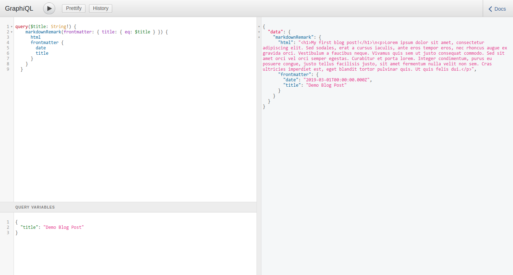

## Đọc bài blog và đưa lên page.

Trước tiên hãy cài đặt plugin của Gatsby:
`bash~yarn add gatsby-transformer-remark gatsby-remark-images`

Khi tôi làm đến đây, trong thư mục `posts` của mình đã có 7 bài blog rồi. Nhưng vì các bạn chưa có bài nào cả, nên chúng ta hãy cùng tạo một bài blog demo.

Tạo một thư mục con tên là `demo` ở trong này. Đưa vào trong đó một file `index.md`

_md?_

MD là viết tắt cho Markdown. Đây là một ngôn ngữ viết file Markup (file có đánh dấu các thành phần của nó, HTML là một) có thể được dễ dàng dịch sang HTML. Bạn nào dùng git nhiều rồi thì sẽ quen với file Readme.md, nhưng nếu không thì cũng không quan trọng, bây giờ thì chỉ cần viết theo mình thôi. Nếu các bạn cần tìm hiểu kỹ, hãy google Markdown syntax

Bây giờ điền vào file `index.md` này đoạn code sau:

```markdown

---
date: 2019-03-01  
title: "Demo Blog Post"  
---

# My first blog post!

Lorem ipsum dolor sit amet, consectetur adipiscing elit. Sed sodales, erat a cursus iaculis, ante eros tempor eros, nec rhoncus augue ex gravida orci. Vestibulum a faucibus neque. Vivamus quis sem ut justo consequat commodo. Sed sit amet orci vel orci semper egestas. Curabitur et porta lorem. Integer condimentum, purus eu posuere congue, justo tellus facilisis justo, sit amet fermentum nulla velit non sem. Cras ultricies imperdiet est, eget blandit tortor pulvinar quis. Ut quis felis dui.
```

Thêm đoạn sau đây vào mục `plugins` file `gatsby-config.js`

```json
{
  resolve: `gatsby-source-filesystem`,
  options: {
      path: `${__dirname}/src/posts/`,
      name: "pages",
  },
},
{
    resolve: `gatsby-transformer-remark`,
    options: {
      plugins: [
        {
          resolve: `gatsby-remark-images`,
          options: {
            maxWidth: 590,
          },
        },
      ],
    },
  },
```

## GraphQL, GraphiQL

Khi đọc các bài blog từ file markdown, Gatsby sẽ dịch nó thành HTML và lưu thông tin này vào dưới dạng các node tương tự như dữ liệu trong một Database và có thể truy vấn được bằng GraphQL

GraphQL về cơ bản là một chuẩn viết API (giống REST). Khi Gatsby tạo được danh sách resource (bài blog, ảnh ...), code frontend của bạn có thể đọc nó bằng các query GraphQL.

GraphiQL là một GUI để bạn test các query. Với Gatsby, bạn có thể truy cập GraphiQL ở `localhost:8000/___graphql`

Nếu bạn làm đúng theo những bước vừa rồi, chúng ta có thể query được bài blog theo cách như sau:

-   Truy cập `localhost:8000/___graphql`
-   Nhập đoạn code sau vào mục bên tay trái:

```graphql

query($title: String!) {
    markdownRemark(frontmatter: { title: { eq: $title } }) {
        html
        frontmatter {
            date
            title
        }
    }
}
```

Bấm vào dòng "Query Variable" ở dưới bên tay trái, sẽ có một ô nhập liệu hiện ra. Điền đoạn code sau vào ô đó:

```json5
{
  title: "Demo Blog Post"
}
```

Chạy Query, bạn sẽ nhận được thông tin về bài viết của bạn, trông giống như sau:



Vậy chúng ta có thể đọc được thông tin của các bài blog. Trong bài tiếp theo chúng sẽ đưa nó vào trong trang web.
