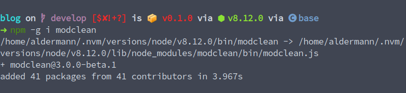
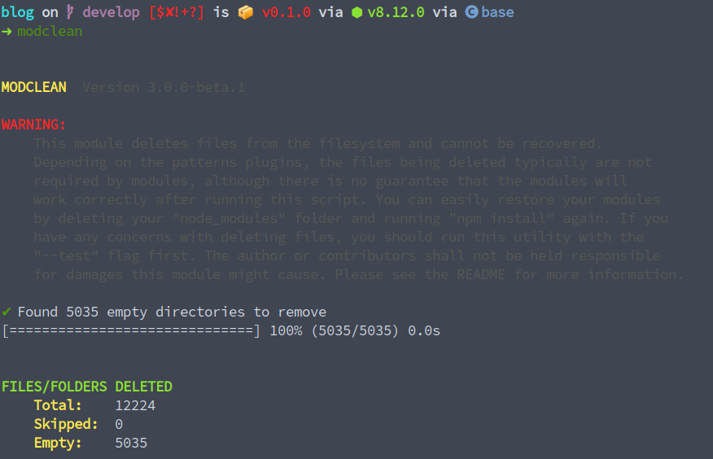
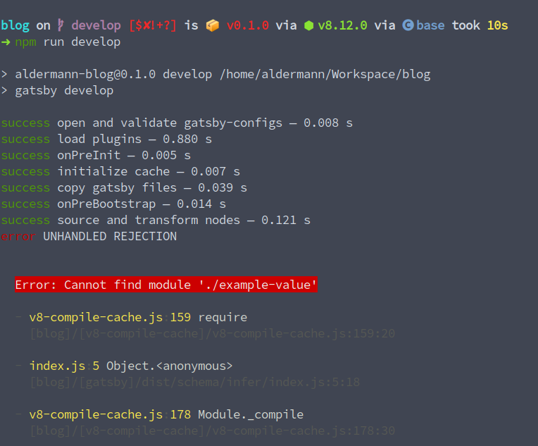

It's just a meme, but not really that exaggerated. If you guys have ever work with Node.js or any other JS frameworks, which still use Node.js for their bundling or building process, you guys all knows how heavy that `node_modules` folder is. This is due to the fact, for some package in the `node_modules`, they are shipped with their own `node_modules`, making the folder buffed up with a lot of duplicated and unnecessary files.  
 
Let me show you a little information of the `node_modules` of this blog, which is build on Gatsby.

- To count the number of files in the folder, run:
```bash
    $ find node_modules -type f | wc -l
    output: 41756
``` 

- To get the total size of the folder, run: 
```bash
    $ du -hs ./node_modules
    output: 392M	./node_modules
```

So that's basically 1/3 of a gig just for a little project. Let inspect the folder a bit so we can see why it is just way to heavy.

Open up the folder, we can see there's a lot of packages that does almost nothing but a single function, aka helper function. For example, the `for-each` package, which is probably used in another package `parse-header`. 
The whole things do only one job, run a forEach over an iterable, which, if I recall correctly, is fully implemented in the Node.js core functionalities. Yet just for that function, the whole package is shipped with another 8 files/folders, all of them do not play any role at all in my project.


Let's take a look at another example. The `webpack-dev-server` package's `node_modules` folder have a package called `yargs`, which helps CLI parse arguments. The thing is, the package `gatsby` is also shipped with `yargs` at the same version as the former. Feeling a bit confused? Let me explain in a (not-so-)simple diagram.

```
    project:
    |
    - node_modules
        |
        - webpack-dev-server
        |   |
        |   - node_modules
        |       |
        |       - yargs@12.0.5
        |
        - gatsby
            |
            - node_modules
                |
                - yargs@12.0.5
```

As you can see, the same `yargs` package is included in two different package. Such duplication does not occur only once, if I have more times I could point out a lot more. 

Look at [my repo](https://github.com/aldermann/aldermann.github.io/tree/develop) yourself if you are in doubt of any information I present above. Just clone it and execute a `bash~npm install`. 

## Solutions
Okay, so after a few Google search, I found __two__ solutions for these two problems above.

### Unnecessary files
If you have a bunch of files that does nothing and takes up disk space, what would you do?

_Delete it_, duh?

[modclean](https://www.npmjs.com/package/modclean) does just that.

Let's try it out, shall we?

First, run `bash~npm -g i modclean`. We install it globally, because we will use it for many other projects.



Then we run `bash~modclean`.



Whoa. Did we just deleted 12224 folders in the blink of an eye? I will run a few commands just to see it doesn't break anything.



___Nope___

Hmm, may be there's still hope. This package is claimed to have been used safely in enterprise grade applications, so maybe I'm just unlucky. Let's try it on another app of mine.

It does work on my [countdown](https://github.com/aldermann/uni_countdown) app, actually. So I do encourage you guys to try it out, and should it break your app, no big deal, just remove your `node_modules` and execute a `npm install` again and you'll be fine.

### Duplicate packages.
This one will be short, because it is still a new tool and is having a lot of compatibility issues, but it's still worth a few run. May I introduce to you, [pnpm](https://pnpm.js.org/).

PNPM is like, a big plugin of npm. For some functions, it pass the works down to npm. It boasts better speed than npm and yarn, which I don't think really matters. The selling point of pnpm is how it maintain the `node_modules`. They use a combination of symlinks, hardlinks and who-know-what-links, so that "One version of a package is saved only ever once on a disk". This effectively solves the second problem I presented above.

However, being a pretty new project, it just doesn't work with some of my projects which use older tools, like this blog itself.
And sadly, Webstorm doesn't support it natively, so I couldn't use it straight in the IDE. These alone deter me from using pnpm extensively. 

But IMO, this tool is really a good one and it's community is thriving. I think it is only a matter of time before it becomes a big deal like `yarn`. In the meantime, I guess I'll have to delete a few games to make space for my `node_modules`