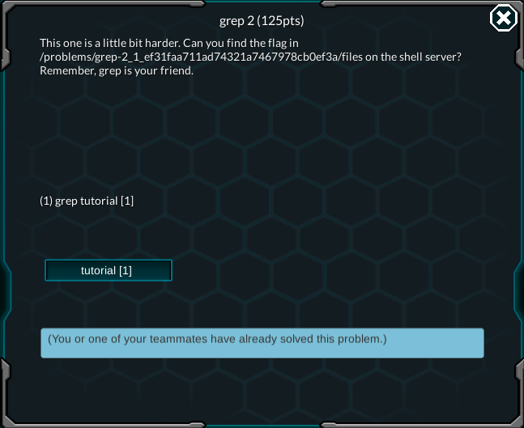
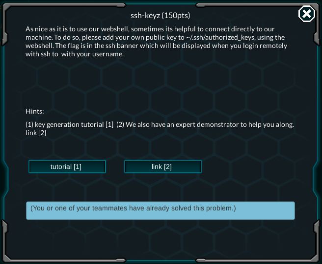

So basically I think it's time to try my hand on some hacking, to see if I can do it.
[PicoCTF](https://2018game.picoctf.com) is a good site for some easy Capture The Flag (CTF) exercise according to my friends, so I guess I would start there.

Okay, let's take a look at the home page. You should be able to register for an account without any problem. After signing in you can go to the [Game tab](https://2018game.picoctf.com/game), where the game will be loaded. Then they will show some introductions so you can get comfortable with the game.

You should do this on some Unix-based OS, like Linux or Mac OS, because they have a lot of useful tools pre-installed.

Including too much image of the problems is going to bloat my repository, so I guess I will show image on hard problems only.

***

## General Warmup 1-2-3
To solve these, just use some kind of converter like [this](https://codebeautify.org/hex-string-converter) 

***

## Resources
Go to the link and find the flag

***

## Grep 1
Download the file. Navigate to the directory where you downloaded it on Terminal, then execute `bash~grep "picoCTF" file`. Voila, you can see the flag.

***

## Net Cat
Okay, for this one you can run `bash~nc 2018shell.picoctf.com 49387`. The flag will be printed to your console.

***

## Strings

First download the file. Running a `bash~cat` on it shows that it is a binary file. However, running it as an executable yields nothing.

However, you can use the `bash~string` command to find plaintext, readable strings inside the file, excluding every binary characters. By running `bash~string file | grep "picoCTF"`, you can sift through the output of `bash~string file` for any string contains "picoCTF". You can see the flag by now

***

## Pipe
In the previous problem, I use a shell syntax called output piping. To put it simply, the output of the previous command will be __"piped"__ to the input of the next command. 

In this problem, running `bash~nc 2018shell.picoctf.com 37542` will yield a fast moving bunch of text. Instead of searching through this mess for the flag, we will pipe it to `bash~grep`, just like the previous problem.

Running `bash~nc 2018shell.picoctf.com 37542 | grep "picoCTF"` will show you the flag.

***

## Grep 2.


This problem will requires you to use the web-shell. Go to the [Shell tab](https://2018game.picoctf.com/shell), you will see a command prompt.

`bash~cd` to the directory given by the problems, then `bash~ls`, you'll be greeted by a bunch of directory. Traversing all of them by hand and check if there is any file contains the flag is not feasible. 

However, `bash~grep` has an option `-R` which search the strings given recursively, and this is what we'll use. Executing `bash~grep -R "picoCTF"` will give you the flag.

***

## ACA-Shell-A
This one is an interesting one, as you will be put in a interactive and narrated shell. It's just like a game on terminal.

First, execute the command in the problem's instruction.

The narrator says that you can ask for help by running `bash~echo 'Help Me!'`. Sweet. Let's try it since we don't really know what to do.

The narrator reply with `Have you looked for any directory`. Let's try a `bash~ls` first

```bash
~/$ ls
blackmail
executables
passwords
photos
secret
```

Sweet. You can poke around in these directories, but what you need is in `secret`. Let's `bash~cd` into it.

A `bash~ls` reveals a bunch of files. The shell then asks you to sabotage the intel files. In order to delete them in a single command, run `bash~ rm intel_*`

The narrator will then tell you to run `bash~echo 'Drop it in!'`. Run it, and there will be a new file in the `~/executables` directory. `bash~cd` to it, then `bash~ls` to see what's the file name. 
```bash
~/executables$ ls
dontLookHere
```

The `dontLookHere` file is an executable, means that you can run it by typing `./dontLookHere`. The screen will print out some hex code, and then the narrator will ask you to find the username. Typing `whoami` will give you the username.

The narrator will finally say that you have to copy a file in `tmp` called `TopSecret` to the `passwords` directory. In Linux, the `tmp` directory resides in root, aka `/`. So you should issue the following command: 

```bash
~/executables$ cp /tmp/TopSecret ../passwords
../password: directory not found or permitted
```

What?
Let's ask the narrator to see if he has any clue.

```bash
~/executables$ echo "Help Me!"
You are going to have to do it from the home folder because of the ".." restrictions!
```

Oh okay, let's try again. `bash~cd ..` to get back to the home folder, then `bash~cp /tmp/TopSecret passwords` to copy the file. It does work this time.

The narrator will then says that the server will shut down in 10 seconds, and you must read the file quickly. Just run `bash~cd passwords` then `bash~cat TopSecret`. You will see the flag for this problem.

***

## Environ

This is going to be easy. Open the web-shell, then execute `bash~env`
The command will show you all the environment variables on the shell. In order to find the flag easily, pipe it to `bash~grep`

***

## SSH-Keyz.



This is a very compicated problem and requires some knowledges in SSH and how it handles authentication keys. You can possibly skips the work and grab the flags by executing `bash~ssh 2018shell.picoctf.com@your_picoctf_username` and enter the password. However, I'll describe about the authentication key approach, because afterward you can SSH to the server without having to enter the password. 

SSH Key Authentication work like this: 
- In order to authenticate, you must own a key pair, one is public and the other private. The private key can be used to decode any data that is encoded using the public key, but the other way around doesn't work. 
- When a client (your computer) send a request to connect to the host (the game's shell server) with a key, first the host will search for a public key that belongs to the client. 
- If a public key is found, the host will use it to encrypt a code, and send it to the client. The client will use the private key to decrypt the code, and send it back to the host. If the host see that the code sent match with the code received, it will establish a connection.

First you have to generate a key pair. It's really simple. Execute `bash~ssh-keygen -C "vietanisme@gmail.com" -t rsa` on your machine. If you are asked  whether to overwrite a file, you can specified a directory to put the key.

After generating the key, you can just copy the public key to the host. First open the public key file and copy the content of it.
Open the webshell and run:
```bash
    echo "the content of the public key" > ~/.ssh/authorized_keys
```

Close the webshell. Open a terminal on your computer and run `bash~ssh 2018shell.picoctf.com@your_picoctf_username`. If all the steps above is done correctly, you should be able to login to the server without having to input password. The flag will be given on login.

***

Okay that's enough for a blog post. Remember to check back for [Part 2](/picoctf-writeup/part2/)