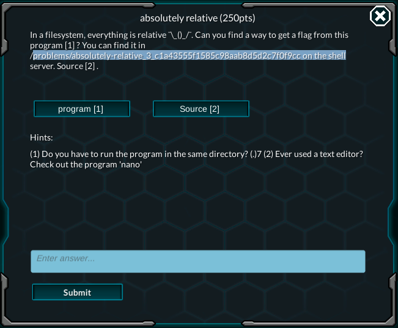

## What base is this?

This is basically a more randomized and timed version of the first 3 problems. After `bash~nc` to the adresss provided by the description, you'll be presented with three quizzes, which require you to convert a string, either in hexadecimal, binary or octal into its ASCII presentation. Just use a converter like [this one](https://codebeautify.org/hex-string-converter) to convert it. Remember to be quick, because they only allow 30 seconds for each quiz.

***

## You can't see me

Login to the shell and goto the directory specified. Doing a `bash~ls` shows nothing.

May be the file is hidden? In order to list hidden file, run `bash~ls -a`.

The output is as follow
```bash
$ ls -a
. . ..
```

That's really confusing isn't it. However, if you are familiar with Linux shells, you'll see that one of the two `.` refers to that directory itself, while the `..` refers to its parent directory. If you run `bash~ls -A`, these two symbols will be ignored. So this means that the folder is actually containing a file with the name `.`.

However, you can not execute any command that refers directly to the name `.`, because the shell will mistake it for the current directory itself. So in order to find the flag, you should use some command that target the whole directory instead. `bash~grep` is a good bet.

To `bash~grep` at a directory, you must include the `-R` flag (recursive). The complete command is `bash~grep "picoCTF" -R .` (the `.` here refers to the folder, not the file). Run that, and the flag will magically appear before you

***

## Absolutely relative.

The problem is starting to get complicating. This problem requires you to understand C code.



Open the shell at the directory and inspect it. You can find 3 files inside: `absolute-relative` is an executable, `absolute-relative.c` is the source code of the former, and `flag.txt` is the file that contain the flag.

You can not read the `flag.txt`, because you don't have the read permission. Only the executable have the permission to read that file, so it is the only way to get the flag.

Let's check the content of the script. Run `bash~cat absolute-relative.c` will yield
```c
#include <stdio.h>
#include <string.h>

#define yes_len 3
const char *yes = "yes";

int main()
{
    char flag[99];
    char permission[10];
    int i;
    FILE * file;

    file = fopen("/.../flag.txt" , "r");
    if (file) {
    	while (fscanf(file, "%s", flag)!=EOF)
    	fclose(file);
    }   
	
    file = fopen( "./permission.txt" , "r");
    if (file) {
    	for (i = 0; i < 5; i++){
            fscanf(file, "%s", permission);
        }
        permission[5] = '\0';
        fclose(file);
    }
    
    if (!strncmp(permission, yes, yes_len)) {
        printf("You have the write permissions.\n%s\n", flag);
    } else {
        printf("You do not have sufficient permissions to view the flag.\n");
    }
    
    return 0;
}
```

This look like a lot but let's tackle it line by line. Two C function that you should understand is `c~fscanf` and `c~strncmp`, for which you could look up the documentation [here](http://www.cplusplus.com/reference/cstdio/fscanf/) and [here](http://www.cplusplus.com/reference/cstring/strncmp/)
From line 14 to line 18, the code read the final sentence of that `flag.txt` file into the `flag` variable. The while loop ensure that the `flag` variable will have the content of the final sentence in the file.

Next, from line 20 to 27 it read every string, seperated by a white-space character in a file called `./permission.txt`. It reads 5 string, then store the value in a char array called `permission`. Each reading iteration overwrite the variable, so the 5th string will be its final value. 

The part of code from line 29 to 33 compare the `permission` string to the string `yes`, up to 3 characters.

Therefore, you must create a `permission.txt` file that contains 5 strings. The first 4 can be anything as long as it is shorter than 9 characters, so that it doesn't overflow the permission variable. The final one should be `yes`. The file must be put in your home folder, since the `/problem/...` is write protected.

After writing such a file, you should execute `/problems/absolutely-relative_3_c1a43555f1585c98aab8d5d2c7f0f9cc/absolutely-relative`. Because you invoke the executable from your home folder, the `./permission.txt` will refers to that `permission.txt` you created above. The flag should be displayed by now.

***

## In-Out-Error

This problem requires some knowledge in redirection. Let's go to the directory in the problem description first.

This folder have two files `flag.txt` and `in-out-err`, the latter being an executable. Let's run it first.

After writing "Please may I have the flag?", the file push out a stream of seemingly random characters. This is due to the fact that the error stream and output stream are printing simultaneously, and if ran on a interactive bash shell these two stream are merged into one. To retrieve the flag, you must split these two stream.

In Linux, there's a special directory call `/dev/null`. Redirecting any stream there will discard the output.
Since we don't know which of the two stream output and error contain the flag, one solution would be to redirect each of them to `/dev/null` and keep the other one intact.

To redirect a stream, use the `>` and `<` operator. If you want to redirect stdout, use `>`. If you want to redirect stderr, use `2>`

Let's run these two commands, see what comes out. When redirecting stdout, remember that the prompt to input "Please may I have the flag?" is redirected too. Worry not, just input it and you'll be fine.

Running `./in-out-error > /dev/null` yields the flag.

***

Starting from here the problem is starting to get harder. Let's checkout [other category](/picoctf-writeup/part3/) first before coming back here.

