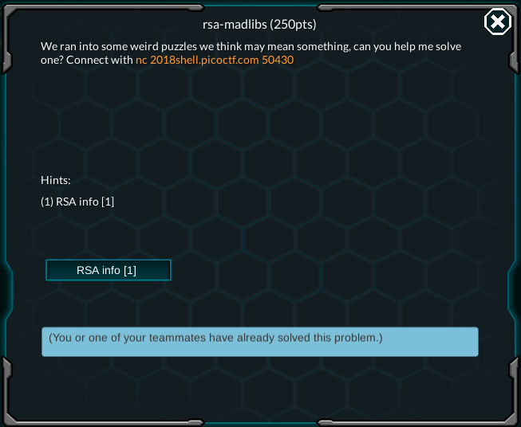

## Crypto Warmup 1
You can see in the table that this is a Vignere cypher. Use some Vignere decypher program online like [this](https://www.dcode.fr/vigenere-cipher) to break it.

***

## Crypto Warmup 2
This is a rot13 cypher. You can use a decypher program to do it, or use the `tr` command in Linux to do it, like this: `bash~tr A-Za-z N-ZA-Mn-za-m <<< "cvpbPGS{guvf_vf_pelcgb!}"`

***

## Here's Johnny
Download the two files in the problem description.

If you `bash~nc` into the host provided, you will see that it asks for an username and a password. The password 

In Linux, there is a file called `/etc/passwd` which store the information of users, and `/etc/shadow`, which store the hashed password.

You can use an utility called `john`, which can be installed pretty easily on Linux via package managers. This utility can crack some simple passwords and is very useful in CTF. 
First you must prepare the password in the files downloaded, using another utility called `unshadow`. This utility is included with `john`. The command accept two arguments, which is the `passwd` file and `shadow` file respectively. Run the following command in the directory where you downloaded the two files:
```bash
unshadow ./passwd ./shadow > key
```

There will be a `key` file which contains the prepared password. In order to crack it, run:
```bash
john -show key                      
```

The output will look a bit like this:
```
root:password:0:0:root:/root:/bin/bash
```

The first string, divided by the colon ":", is the username, and the second string is the password.

`bash~nc` back to the host, input the credential, and grab the flag.

***

## Ceasar Cipher 1
The name said it all. You should use a Ceasar cipher solver online to help you with this, something like [this](https://cryptii.com/pipes/caesar-cipher) page.

First you should download the message file in the problem description, which contain a string like this `picoCTF{payzgmuujurjigkygxiovnkxlcgihubb}`. Only the part inside the bracket should be decrypted.

In order to do decipher a Ceasar message, you should have a shift number. However, since there's only 26 possible ways to shift, you can just try out every shift numbers and see if there is any meaningful words. In my case, the shift number is 6. Here's a picture of my page:


***

## Hertz.
Let's just connect to the host as usual. The port spews out a bunch of string, so I just redirect the output into a file for reading ease, like this `bash~nc 2018shell.picoctf.com 43324`.

Let's take a peek at the file. Not much, there is a bunch of random characters. But there's a clue in the problem title. "Hertz" is the unit of frequency, so may be this code can be decoded using frequency analysis.

Frequency analysis is a method of decoding subsitutional cipher (i.e. replacing each character with another character base on a agreed rule), which involves calculating the frequencies of every character in the crypted message, then guess the substituting rule based on a table of characters' frequencies in normal language. For example: if your cipher have the character "D" appearing in 9.2% of the cases, it's very likely to be subtituted to "T", which have a frequency of 9.1% in normal English.

You should first analyse the cipher, then apply the characters replacing rule in it's respective order of frequency. Then, if you catch any half-meaningful word, change the subtitution rule so that it makes a meaningful one. This process is basically trial and repeat, so be patient.


***
## RSA madlibs

This is by far the most frustrating problem I've ever encountered, because if you input one wrong answer you will have to do the whole thing again. Beside, it requires some mathematical knowledge and skill, so I suggest using Python Console to handle the computing work.



First let's `nc` into the host, and you will be taken into some sort of quiz. The questions will revolve around the RSA algorithm, so let's open the link provided. Take a look at the algorithm in the wiki page.

### 1<sup>st</sup> question: 
This question ask you if you can calculate $n$ from $p$ and $q$. The algorithm states that $n = p * q$, so that's completely feasible. Answer yes and input the answer which is $8815769761$

### 2<sup>nd</sup> question:
The second one ask you to calculate $q$ from $p$ and $n$, which is also feasible. Input $77773$ as the answer

### 3<sup>rd</sup> question: 
They will ask you to get $p$ and $q$ from $n$. Theoretically, this would be possible because you can just find $p$ and then calculate $q$ by dividing $n$ by $p$. However, the algorithm maintain that $p$ and $q$ are two prime numbers, so the process of finding $p$ will takes up an average of $O(\sqrt(n))$ operations, which is, in this case, not feasible for $n$ around $10^{600}$

### 4<sup>th</sup> question:
This one will ask you to calculate the totient of $n$ or $\phi(n)$, which is stated to be $(p - 1) * (q - 1)$ in the algorithm description page. Input $6256003596$ as the answer. 

### 5<sup>th</sup> question:
The next one will need you to use Python console, because they'll help you with calculations on big number. I really recommend installing IPython, for which you can find installation instruction [here](https://ipython.org/install.html). IPython is basically a better shell than Python's default, offering you instropection, completion, and shell history.

Okay, open a terminal and run `ipython` to start it. This question ask you to calculate the $ciphertext$ from the plaintext, $e$ and $n$. Look at the encryption section of the wiki page to see how. Since we are not specified any padding scheme, let's use the plaintext message as $m$ in the formula, which is $c=m^{e}\mod {n}$. The IPython console might look like this:
```python
In [1]: plaintext = 181590718...                                                   

In [2]: e = 3                                                                   

In [3]: n = 291294636...                                                           

In [4]: ciphertext = plaintext ** e % n                                         

In [5]: ciphertext                                                              
Out[5]: 267229175...
```

Input that last output to get pass this question.

### 6<sup>th</sup> question:
Next, they will ask you to get the $plaintext$ from the $ciphertext$, $e$ and $n$. Since $e$ and $n$ is released as part of the public key, it wouldn't make much sense to be able to decipher the $ciphertext$ from just a public key isn't it. Let's just input No and get to the next question.

### 7<sup>th</sup> question:
The question requires you to calculate $d$ that follows the relation $de \equiv  1 (\textrm{mod}\ \phi(n))$, or $d$ is the modular inverse of e. To calculate this, use the Extended Euclidean Algorithm. I've included a quick implementation of it that I found online, just paste it in your IPython shell. The whole process should look like this:

```python
In [1]: q = 920920768...             

In [2]: p = 978467753...             

In [3]: e = 65537                                                                                                     

In [4]: totient = (q - 1) * (p - 1)

In [5]: def egcd(a, b): 
            if a == 0: 
                return (b, 0, 1) 
            else: 
                g, y, x = egcd(b % a, a) 
                return (g, x - (b // a) * y, y) 

        def modinv(a, m): 
            g, x, y = egcd(a, m) 
            return x % m 

In [6]: d = modinv(e, totient)

In [7]: d

Out[7]: 140504626...
```

Input 7<sup>th</sup> output to get pass the level.

### 8<sup>th</sup> question:
This is the final and most complicated question, requiring you to decrypt the $ciphertext$ given $n$, $p$ and $e$. Let's check out the Decrypting section of the guide on how to do this.

The formula given is $m = c^d \mod n$, where $m$ would be the final plaintext that you need and $c$ is the ciphertext that you're given. First you get $q = n / p$, then you can calculate $d$ by following the same procedure as in the last question. Finally, you can use the `py~pow(c, d, n)` function in Python to quickly calculate $c^d \mod n$. The whole IPython console should look like this.

```python
In [1]: p = 153143042...

In [2]: e = 65537

In [3]: n = 239529373...

In [4]: c = 313988037...

In [5]: q = n // p

In [6]: totient = (q - 1) * (p - 1)

In [7]: def egcd(a, b): 
            if a == 0: 
                return (b, 0, 1) 
            else: 
                g, y, x = egcd(b % a, a) 
                return (g, x - (b // a) * y, y) 
         
        def modinv(a, m): 
            g, x, y = egcd(a, m) 
            return x % m 

In [8]: d = modinv(e, totient)

In [9]: m = pow(c, d, n)

In [10]: m
                      
Out[10]: 240109877...
```

Grab that final output and input it, to get pass the question.

Finally, they ask you to convert that output to hex, then to ASCII to get the flag. You can use the following command in Python to do it.

```python
In [15]: hex_string = hex(m) 

In [16]: hex_string

Out[16]: '0x7069636f4354467b64305f755f6b6e30775f7468335f7740795f325f5253405f38643037393632337d'

In [19]: bytearray.fromhex(hex_string[2:]).decode()

Out[19]: 'picoCTF{...}'
```

The `py3~hex_string[2:]` is to strip of the two signal character `0x` at the begining of the hex_string.

***

Well that's it for a day. Let's continue on this later.