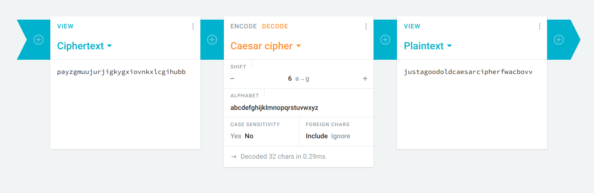

## Crypto Warmup 1
You can see in the table that this is a Vigenere cypher. Use some Vigenere decypher program online like [this](https://www.dcode.fr/vigenere-cipher) to break it.

***

## Crypto Warmup 2
This is a rot13 cypher. You can use a decypher program to do it, or use the `tr` command in Linux to do it, like this: `bash~tr A-Za-z N-ZA-Mn-za-m <<< "cvpbPGS{guvf_vf_pelcgb!}"`

***

## Here's Johnny
Download the two files in the problem description.

If you `bash~nc` into the host provided, you will see that it asks for an username and a password. The password 

In Linux, there is a file called `/etc/passwd` which store the information of users, and `/etc/shadow`, which store the hashed password.

You can use an utility called `john`, which can be installed pretty easily on Linux via package managers. This utility can crack some simple passwords and is very useful in CTF. 
First you must prepare the password in the files downloaded, using another utility called `unshadow`. This utility is included with `john`. The command accept two arguments, which is the `passwd` file and `shadow` file respectively. Run the following command in the directory where you downloaded the two files:
```bash
unshadow ./passwd ./shadow > key
```

There will be a `key` file which contains the prepared password. In order to crack it, run:
```bash
john -show key                      
```

The output will look a bit like this:
```
root:password:0:0:root:/root:/bin/bash
```

The first string, divided by the colon ":", is the username, and the second string is the password.

`bash~nc` back to the host, input the credential, and grab the flag.

***

## Ceasar Cipher 1
The name said it all. You should use a Ceasar cipher solver online to help you with this, something like [this](https://cryptii.com/pipes/caesar-cipher) page.

First you should download the message file in the problem description, which contain a string like this `picoCTF{payzgmuujurjigkygxiovnkxlcgihubb}`. Only the part inside the bracket should be decrypted.

In order to do decipher a Ceasar message, you should have a shift number. However, since there's only 26 possible ways to shift, you can just try out every shift numbers and see if there is any meaningful words. In my case, the shift number is 6. Here's a picture of my page:


***

## Hertz.
Let's just connect to the host as usual. The port spews out a bunch of string, so I just redirect the output into a file for reading ease, like this `bash~nc 2018shell.picoctf.com 43324`.

Let's take a peek at the file. Not much, there is a bunch of random characters. But there's a clue in the problem title. "Hertz" is the unit of frequency, so may be this code can be decoded using frequency analysis.

Frequency analysis is a method of decoding subsitutional cipher (i.e. replacing each character with another character base on a agreed rule), which involves calculating the frequencies of every character in the crypted message, then guess the substituting rule based on a table of characters' frequencies in normal language. For example: if your cipher have the character "D" appearing in 9.2% of the cases, it's very likely to be subtituted to "T", which have a frequency of 9.1% in normal English.

You should first analyse the cipher, then apply the characters replacing rule in it's respective order of frequency. Then, if you catch any half-meaningful word, change the subtitution rule so that it makes a meaningful one. This process is basically trial and repeat, so be patient.

***

## Blaise's Cipher

First netcat to the host to get the cipher. Redirect them into a file for editing ease.
A quick search on the internet show that this is also a Vigenere cipher, since the inventor's full name is Blaise de Vigenere.

However, because we don't know the key, an automatic cracking tool should be employed to quickly break this. I suggest using the "TRY TO DECRYPT AUTOMATICALLY (STATISTICAL ANALYSIS)" option in this [page](https://www.dcode.fr/vigenere-cipher).

Very quickly, we can see that the key is "FLAG". Plug "FLAG" in the "KNOWING THE KEY" option in the same page to decrypt the whole cipher. Search through it to find the flag.

***

## Hertz 2

This is also a subsitutional cipher like Hertz 1, but a bit harder. I suggest looking at the characters before the "{"
Since we know it must be "PICOCTF", you should start changing your substitute table base on that first. That should give you a head start.

***

## Safe RSA

This problem will revolve around the RSA algorithm, so let's open the link provided. Take a look at the algorithm in the [wiki page](https://en.wikipedia.org/wiki/RSA_(cryptosystem)).

First download the file given in the problem description. There are three numbers, all are part of the formulae in the RSA algorithm.

You should use Python console to work with this problem, because they'll help you with calculations on big number. I really recommend installing IPython, for which you can find installation instruction [here](https://ipython.org/install.html). IPython is basically a better shell than Python's default, offering you instropection, completion, and shell history.

Okay, open a terminal and run `ipython` to start it. 

Looks at the "Encryption" section of the wiki page.

The problem gives us $ciphertext$ , $n$ and $e$. $ciphertext$ is equivalent to $c$ in this following formula:

$$
c \equiv m^{e} \pmod {n}
$$

or equivalently:
$$
m^{e} = k*n + c 
$$

with $k$ is an arbitrary integer.

What we need to calculate is $m$. In practice, this would not be feasible, but as for this problem, e is small (only 3), so we can brute-force for $m$ by taking $\sqrt[3]{kn + c}$ with every $k \ge 0$, and check if the result is an integer.
In order to calculate cube root for big integer, I have implemented a function using [binary search](https://en.wikipedia.org/wiki/Binary_search_algorithm). You can just type this into the IPython console, like this:
```python
In [1]: def cube_root(a): 
            l,h,m = 0,a,0 
            while (l <= h): 
                m = (l + h) // 2 
                x = m ** 3 
                if (x >= a): 
                    h = m - 1; 
                else: 
                    l = m + 1; 
            return h; 
```

This will return $\left \lfloor{\sqrt[3]{a}}\right \rfloor$. Then run the following commands in the console:

```python
In [2]: import itertools                                                       

In [3]: def crack(): 
        for i in itertools.count(c, n):  
            x = cube_root(i)  
            if x ** 3 == i:  
                return x 

In [4]: result = crack()

In [5]: result
Out[5]: 1301638252...

```

If you submit that result as the flag you won't get through. First you should convert it into hex, then from hex to ASCII. Run the following commands:
```python
In [6]: hex_string = hex(result)  

In [7]: bytearray.fromhex(hex_string[2:]).decode()                             
Out[7]: 'picoCTF{...}'
```

Now you can submit the flag.

***

Well I'm tired. Let's get back on this tomorrow.